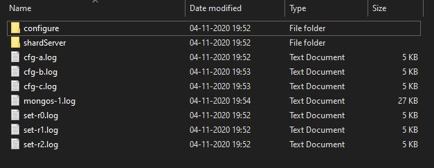

# MongoDB-Sharding-Script
Batch Script for creating a completely automated MongoDB Sharding Server - for Windows

## Prerequisites
* Mongo DB must be installed (latest version)
* Check if MongoD and MongoS are pre-installed
* Make sure Mongo and MongoD is accessible globaly - if not, add mongodb/bin to env. variables

## Steps to Run.
1. Download and Extract all the 3 files.
2. Place all the 3 files at the root installation folder.
3. Run the `MongoDB Sharding.bat` file on your terminal.

## NOTE:
By default the script creates a 3 replica set MongoDB Sharding Server.

## SAMPLE:
Folder structure of Sharding Server
 

